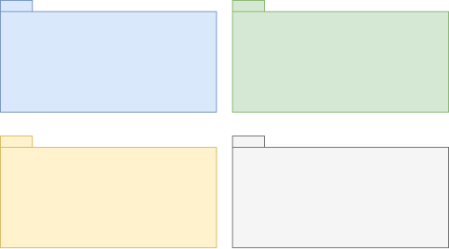

<h1 style="text-align: center;">Typescript Rest API with S.O.L.I.D</h1>

This project use Package by Feature Architecture

## Libs used on project

**dependencies**
* express
* nodemailer
* ts-node-dev
* typescript
* uuidv4

**devDependencies**
* @types/express
* @types/nodemailer

## Install dependencies and Run Project

Install dependencies
`yarn` or `npm i`

Start project
`yarn start` or `npm start`

server run on `3333` port

